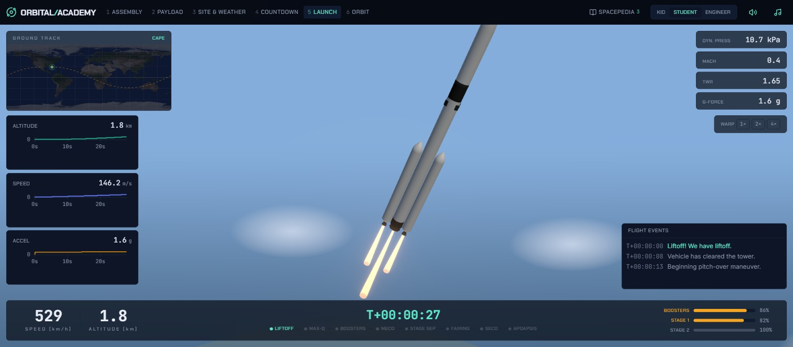
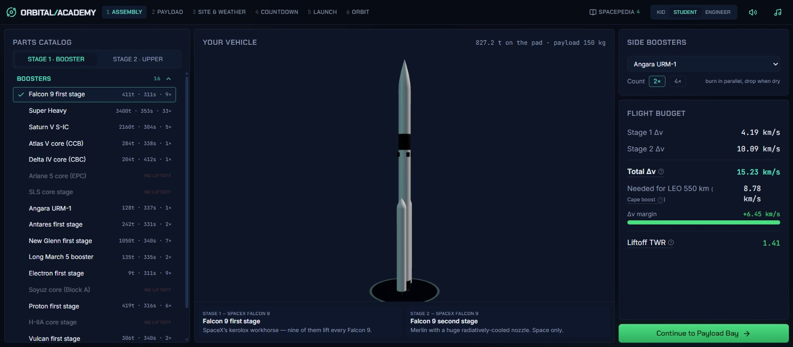
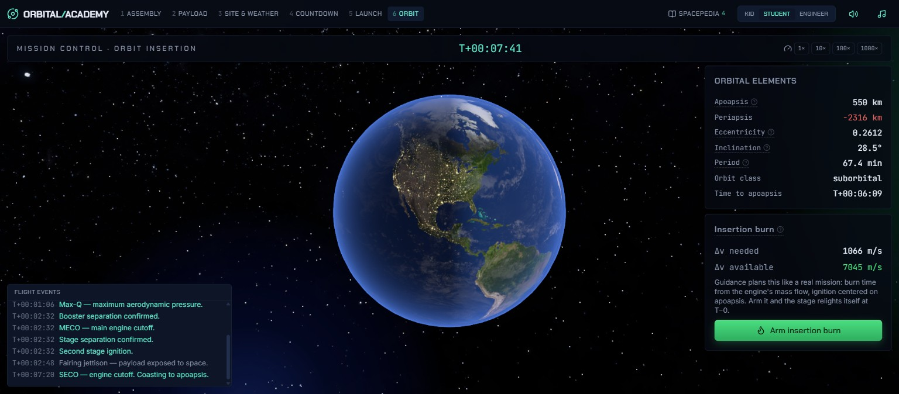
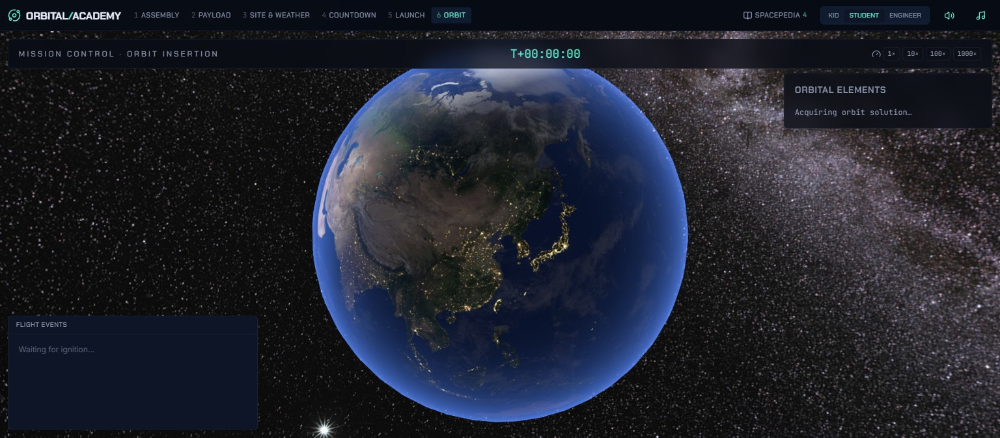
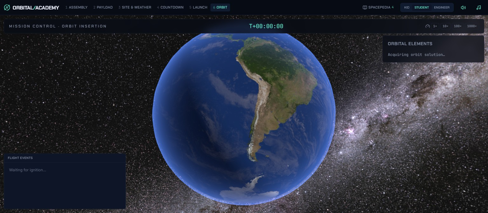
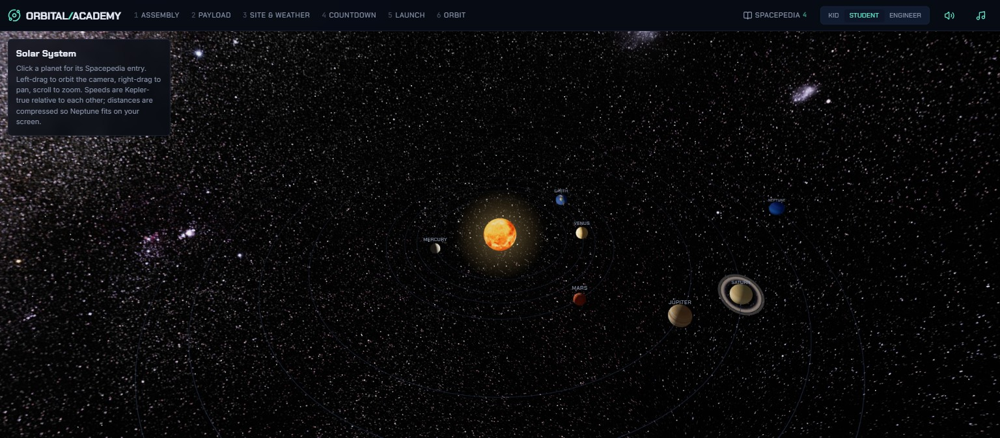

# Orbital Academy (satellite-sim)

A physics-first space program for every age, in the browser. Build a rocket from
**real flight hardware** (Falcon 9, Saturn V, Angara, Electron, Starship…), fight
the weather through a real go/no-go poll, fly the launch from a SpaceX-webcast-style
mission control room, arm a guidance-planned insertion burn at apoapsis — and
unlock the Spacepedia and Solar System explorer as you go.

**Play it:** [psabhinav.github.io/satellite-sim](https://psabhinav.github.io/satellite-sim/)
· [satellite-simulator.vercel.app](https://satellite-simulator.vercel.app/)

Successor to Satellite-Sim Phase 3/4: rebuilt from scratch with an actual
physics engine instead of mock telemetry.



## The mission flow

1. **Assembly** — a parts catalog of ~30 real engines and ~34 real stages,
   classified by component type (boosters, upper stages, spaceships, kick
   stages, solids). Add **side boosters** (2× or 4×, parallel staging — they
   burn with the core and drop when dry). Combinations that can't lift off are
   disabled with the reason shown; a suggestion appears only when your design
   is actually broken. The 3D vehicle in the center is built from your exact
   selected parts at real dimensions and liveries.
2. **Payload** — pick the satellite; it sets the target orbit and the Δv bar
   your rocket has to clear.
3. **Site & Weather** — Cape Canaveral, Kourou, Vandenberg, Sriharikota.
   Latitude is physics: it sets the minimum inclination and the free
   Earth-rotation Δv. Weather is seeded and deterministic, run through
   real-style launch-commit criteria and a go/no-go roll-call poll.
4. **Countdown** — terminal count with holds, a broadcast lower-third
   checklist, and a live "next real-world launch" card (Launch Library 2).
5. **Launch** — the webcast console: the flight fills the screen, instruments
   float over it as glass. Big speed/altitude numbers, center MET clock,
   milestone pips that light as events fire (Max-Q, booster sep, MECO, stage
   sep, fairing, SECO), per-stage + booster fuel bars, dynamic pressure /
   Mach / TWR / g chips, live strip charts, the flight-director loop, and a
   ground-track map with the **planned trajectory pre-drawn** and the live
   position blinking along it.
6. **Orbit** — coast to apoapsis and fly a **real orbit insertion**: arm the
   burn and guidance computes the Δv, derives the burn duration from the
   engine's true mass flow, ignites automatically centered on apoapsis
   (SES-2), steers closed-loop along the remaining-Δv vector while propellant
   drains, and cuts off at SECO-2. The drawn orbit ellipse grows live during
   the burn — real integration, not a redraw.
7. **Debrief** — flight record (peak q, peak g, final elements vs target) and
   a "why did this happen?" explainer matched to the outcome, with a retry
   that jumps to the right screen.




## The physics is real

All simulation runs in the browser, in a pure-TypeScript core (`src/sim/`) with
a 38-test known-answer suite:

- **Tsiolkovsky rocket equation** per stage — Δv budgets, TWR, mass ratios;
  parallel-staging phases use thrust-weighted effective Isp
- **RK4 ascent integration** in the inertial launch plane: inverse-square
  gravity, exponential-atmosphere drag against the rotating air,
  pressure-blended thrust, TWR-adaptive gravity-turn steering at zero angle
  of attack, separate booster propellant pool
- **Closed-form Kepler propagation** on orbit (zero drift at 1000× time-warp),
  state-vector ↔ orbital-elements conversion
- **Finite insertion burns**: ignition timed at t_apo − t_burn/2, thrust along
  the live circularization-Δv vector, mass flow ṁ = F/(Isp·g₀), cutoff on
  residual — the same closed-loop shape a real upper stage flies
- **Seeded weather + launch-commit criteria** modeled on the real
  lightning/wind rules — same site + same day always gives the same briefing
- Honest failure modes: max-Q breakup, trajectory sag, reentry, propellant
  depletion, escape — each explained in the debrief at your chosen depth

Explanations adapt via the age dial: **Kid / Student / Engineer**, down to the
formulas (KaTeX) on every concept chip.

## The sky is real too



- The skybox is **ESO's Milky Way panorama** (S. Brunier) — an actual
  photograph of the galaxy: golden core, dust lanes, the Carina nebulae, both
  Magellanic Clouds.
- One sun drives everything: the visible disc, the scene lighting, and the
  Earth shader's day/night terminator always agree. City lights come out on
  the night side; the cloud layer drifts like a living planet.
- 8K day Earth for the orbit view; the Solar System explorer has all eight
  planets on Kepler-true relative periods, with Saturn's rings rendered from
  the real ring-alpha strip at true proportions (B ring, Cassini division,
  A ring).




## Built to survive school laptops

Integrated GPUs reclaim WebGL contexts under pressure — and sometimes never
restore them. Every scene canvas remounts itself on context-restore (fresh
renderer, fresh post-processing chain) and runs a watchdog that forces a new
context when the restore never arrives. Texture budgets are tiered (8K Earth
only where it's the hero), device-pixel-ratio is capped, and there's a
low-graphics toggle.

## Run it

```bash
npm install
npm run dev        # http://localhost:5173/satellite-sim/
npm test           # physics known-answer suite
npm run build
```

Deploys automatically to GitHub Pages (Actions) and Vercel on push to `main`.

## Simplifications (taught, not hidden)

Spherical Earth (no J2), no third body, isothermal atmosphere, point-mass
vehicle, due-east launches (inclination = site latitude). Each is labeled
in-app where it matters.

## Credits

Earth textures derived from NASA Blue Marble imagery (via the original
Satellite-Sim repos, recompressed). Music and sound are synthesized live in
Web Audio — no audio assets. Built with React 19, three.js/R3F, zustand,
uPlot, Radix, Tailwind v4.

Planet textures by Solar System Scope (solarsystemscope.com/textures), CC BY 4.0.

## Asset & license audit
- Planet, Sun, 8K Earth day/night maps: Solar System Scope
  (solarsystemscope.com/textures) - CC BY 4.0, attribution above. These are
  themselves derived from NASA imagery (public domain).
- Milky Way skybox: "The Milky Way panorama" - ESO/S. Brunier
  (eso.org/public/images/eso0932a) - CC BY 4.0.
- Earth cloud layer: NASA Blue Marble derivative (public domain source imagery).
- Fonts: Chakra Petch, Inter, JetBrains Mono via Fontsource - SIL Open Font License.
- Libraries: React, three.js, @react-three/fiber & drei, zustand, uPlot, KaTeX,
  Radix UI, Tailwind - MIT; lucide icons - ISC.
- Music, sound effects, rocket and pad models: generated procedurally in this
  repo (no third-party assets).
- Live launch data: [Launch Library 2](https://thespacedevs.com/llapi) by
  The Space Devs (free tier).
